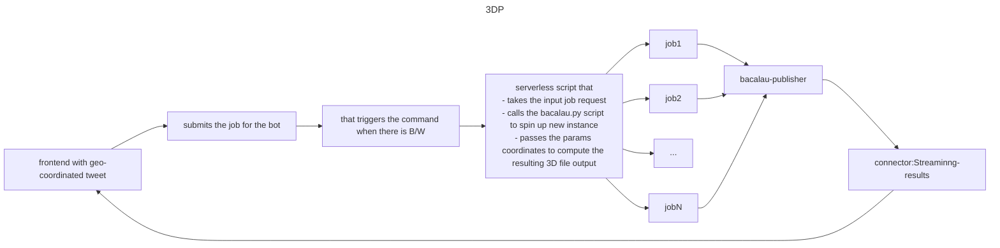

# LidarhdBot

Bot application for running geospatial 3D mesh reconstruction algorithms on decentralised compute via discord messages.


## Status
- [Docker-compose-passing](https://github.com/The-Extra-Project/lidarhdpip/actions/workflows/test-docker-build.yml/badge.svg).
- [Codepipeline-deploy](https://github.com/The-Extra-Project/lidarhdpip/actions/workflows/test-docker-build.yml/badge.svg).


## Stack:

- **Serverless messaging using**: [upstash]().

- **rendering visualization using**: [Streamlit]().

- **compute over Data using** [bacalhau]():

- **decentralised storage on top of**[web3.storage]:

- **bot service running on top of**[discord.py]:  

## Credits 

-  [bert lidar rendering pipeline](https://github.com/bertt/nimes):For the description concerning the geosptial data reconstruction algorithms. 

- [Dockerised discord bot template]()

- [kafka examples]()

## packages description:

1. [Georender](./georender/): Core package that implements the functions to convert the given pointcloud file to .laz 3D tile format.

2. [Bots](./bots/): Package for discord bot logic and commands.

3. [aws_deployment](./aws_deployment/): Scripts to deploy the necessary infrastructure on registered AWS cloud.

4. [visualization](): This is the rendering app written in streamlit that shows the result once the mesh reconstruction job is completed


## Build instructions/Setup:

### 1. Locally running the bot:

1. We need to set following enviornment variables 
    - For the kafka messaging service. the reference env file is defined in the `.env.example` here. 
    - Then define the discord configuration in the config.json in 'bots/Discord/config.json', by following the steps defined [here](https://github.com/topics/discord-bot-template).


2. Then build the container application by running the Dockerfile for the streamlit and subsequentially that of the bacalau_sdk service.

### 2. On cloud instance (AWS): 

1. Setup the awscli parameters for the account and access token.  

2. Then run the scripts as defined below.


```sh
cd aws_deployment/ && cdk synth
# if its for the first time , you will be prompted to run the following command also
cdk bootstrap
```

- Follow the instructions in the [readme]() of the aws_repository in order to provide the necessary permissions to your account in order to address errors.

4. Setup the personal [web3.storage]() account and define the access token in the .env file.

5. Store the files on web3.storagefrom where you want to fetch the mapping format (shape/obj files). we have stored the reference files in [data/](./datas/) . and then keep the reference cid generated for the user as parameter to pass for generating the  reconstruction job. 
    - for more detials regarding the files latest version, checkout the following
        - https://geoservices.ign.fr/lidarhd
        - https://pcrs.ign.fr/version3


### API's

discord bot api
```markdown
/circum job_point <<Xcoordiante>> <<Ycoordinate>> <<ipfs_shp_file>> <<ipfs_pipeline_template_file>> : runs the reconstruction job for the given point coordinate and returns the job id.

/circum status <<job_id>>: checks status of the reconstruction job with given id.

/circum result <<job_id>>: fetches the result (laz file cid) once the job is completed.

/circum visualize <<ipfs_cid>>: generated laz file visualization link.
```
# Detailled pipeline of the circum reconstruction process:




