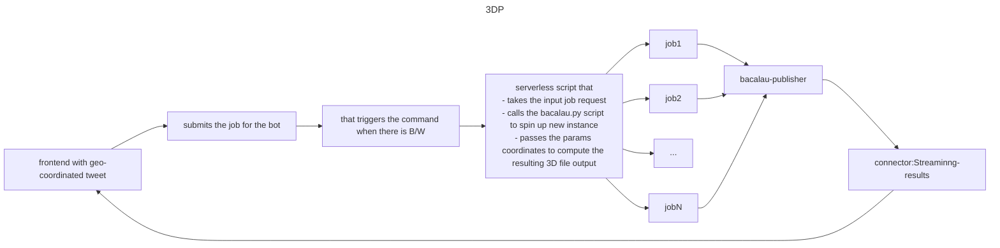

# LidarhdBot

 Application for running geospatial rendering algorithms on decentralised compute via users prompts via tweet / discord messages.

## Status

[Docker-compose-passing](https://github.com/The-Extra-Project/lidarhdpip/actions/workflows/test-docker-build.yml/badge.svg).

## stack
- **Serverless messaging using**: [upstash]() / [confluent]()

- **application development framework**: [Streamlit]()

- **compute service on top of** [bacalhau]:

- **bot service running on top of**[discord] / [twitter]: 

## Credits 
- https://github.com/bertt/nimes

## Build instructions / setup:

1. We need to set enviornment variables 
    - setting up the parameters for the kafka messaging service. it can be setup on either upstash / confluent, by defining in the utils/kafka/client_properties.py

2. Then deploy the container application by running the Dockerfile for the streamlit and subsequentially that of the bacalau_sdk service eventually.

3.The LiDAR HD tiles that are being processed can be downloaded from:
- https://geoservices.ign.fr/lidarhd
- https://pcrs.ign.fr/version3

# Detailled pipeline / tasks

## packages:

1. [Georender](./georender/): core package that implements the functions to convert the given pointcloud file to .laz 3D tile format.

2. [Twitter bot](./twitter_bot/): this is the script which is wrapper on tweepy package, allowing users to interact with their developer account.

# Build and Run instructions

## 2. Then run the images locally 

2.1 The steps for the backend are defined in the `execute.sh`, but before we need to instantiate the following parameters:

## 2.1 setting up the confluent_kafka pipeline:
there can be two ways: 

2.1.1 Either testing on the free instance:
    - Setup the [confluent-cloud]() enviornment .
    - Fetch the API keys and other parameters and store in the ``.

2.1.2 Either setting up the local instance of the [confluent-kafka image](https://hub.docker.com/r/confluentinc/cp-kafka/): 
    - then adding the API parameters in the client.properties files as defined before.

## 3. fetching the files in the given container for processing: 

