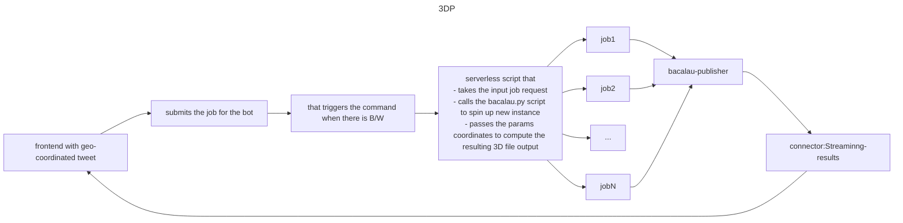

# 3D rendering of a IGN LiDAR point cloud

## Status

[Docker-compose-passing](https://github.com/The-Extra-Project/lidarhdpip/actions/workflows/test-docker-build.yml/badge.svg).

[azure-pipelines-passing]()


The goal of this project is to provide a 3D viewer for any LiDAR HD point Cloud which is generated by the user that defines the coordiantes via tweet.

## Credits 
- https://github.com/bertt/nimes

The LiDAR HD tiles that are being processed can be downloaded from:
- https://geoservices.ign.fr/lidarhd
- https://pcrs.ign.fr/version3
All files are referenced in a json file.

# Detailled pipeline / tasks



## packages:

1. [Georender](./georender/): core package that implements the functions to convert the given pointcloud file to .laz 3D tile format.

2. [Twitter bot](./twitter_bot/): this is the script which is wrapper on tweepy package, allowing users to interact with their developer account.


3. [Kafka](./kafka/): to host the kafka producer and consumer that takes the messages from the other microservices


# Build and Run instructions


- setting up the enviornment variables: 

-  Build and run the docker image locally by doing the required changes and running:
```console
docker-compose build
``` 


## 2. Then run the images locally 

2.1 The steps for the backend are defined in the `execute.sh`, but before we need to instantiate the following parameters:


## 2.1 setting up the confluent_kafka pipeline:
there can be two ways: 

2.1.1 Either testing on the free instance:
    - Setup the [confluent-cloud]() enviornment .
    - Fetch the API keys and other parameters and store in the `kafka/client.properties`.

2.1.2 Either setting up the local instance of the [confluent-kafka image](https://hub.docker.com/r/confluentinc/cp-kafka/): 
    - then adding the API parameters in the client.properties files as defined before.

## 3. fetching the files in the given container for processing: 

This will be done by the data stored in the [web3.storage]() account of the user, for that developer has to 

- Define the API token in the build command

- And then transfer the file by running the `transfer_files.sh` command.

```console
docker cp src/main.py $(docker ps -aqf "name=georender_georender" | head -n 1):/usr/src/app/georender/src/
```
## 4.  Use pdal to convert Las File

we use pdal to convert the compressed laz file to a las. functions are defined in the  
```console
pdal pipeline full_pipeline.json
```
then a 3D tile can be created from the "result.las" file converted by pdal
## Create a 3D tile from las: 


```console
gocesiumtiler -srid 2154 -input result.las -output 3dtiles -zoffset 60
```
