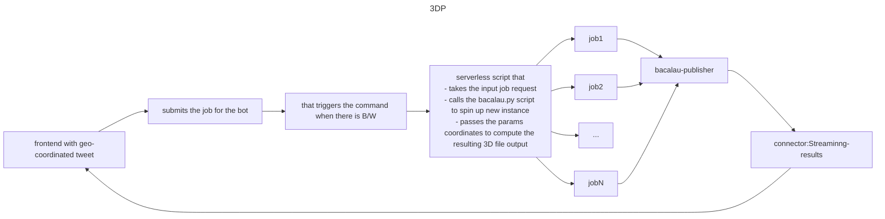

# 3D rendering of a IGN LiDAR point cloud
The goal of this project is to provide a 3D viewer for any LiDAR HD point Cloud.
This service will aviable through a twitter BOT
- User reply a posal adress to the  bot
- the bot reply with  the link and a screenshot of the point cloud

## Notes 
This project does what we want to do, we just have to automatize everything
https://github.com/bertt/nimes

## The dataset
Each LiDAR HD tile can be downloaded her 
- https://geoservices.ign.fr/lidarhd
- https://pcrs.ign.fr/version3
All files are referenced in a json file.

# Detailled pipeline / tasks



## Twitter bot
-  This will be done by a serverless script that will be triggered by a confluent Kafka topic
-  The script will take the input job request and will call the bacalau.py script to spin up new instance
-  The script will pass the params coordinates to compute the resulting 3D file output file and store it to the backend.

## Local pipeline
- ☑ Locate Tile according to a 2D coordinate and dumping informations 
  We parse the shapefile "TA_diff_pkk_lidarhd.shp" aviable in the IGN website and intersect the 
  bounding box of the 3D tile with the 2D coordinate with the geopanda API
  - Improvement  :
      - ☐ : Input a bounding box instead of a 2D coordinate
	  
- ☑ The revelent archive file is downloaded with wget inside docker
- ☑ The archive is extracted (that produces 4 Las file)

- ☐ pdad is used to preprocess the files
    - ☐ : Build the right json pipeline (with the 4 las file) at this point
	- improvement : 
		- ☐ : crop the pointcloud according to the bounding box
- ☐ A 3D tile in created from the preprocessed file from pdal with gocesiumtiler
## Server
- ☐ : choice an architecture and the specifications

## Viewer
- ☐ : find a good frontend 3D tile viewier here https://github.com/pka/awesome-3d-tiles
- ☐ : Poc of the viewer


# Build and Run
Actually, a draft of the program is computed offline into a docker image.
## Build the docker image

```console
docker-compose build
```
## Run full pipeline locally
The first steps of the pipeline are implemented in the script "run.sh"
current version from 2D coordinate to extracted LAZ
```console
docker-compose run --rm georender /bin/bash -c "bash /usr/src/app/georender/run.sh"
```

# Programmer note
## Copy file inside running container
```console
docker cp src/main.py $(docker ps -aqf "name=georender_georender" | head -n 1):/usr/src/app/georender/src/
```
## Download file with wget
```console
wget --user-agent=”Mozilla” "https://wxs.ign.fr/c90xknypoz1flvgojchbphgt/telechargement/prepackage/LIDARHD_PACK_NP_2021\$LIDARHD_1-0_LAZ_NP-0806_6303-2021/file/LIDARHD_1-0_LAZ_NP-0806_6303-2021.7z"
```
## Use pdal to convert Las File
we use pdal to convert the compressed laz file to a las (dummi sript, can be used for more complex task latter)
```console
pdal pipeline full_pipeline.json
```
then a 3D tile can be created from the "result.las" file converted by pdal
## Create a 3D tile from las
```console
gocesiumtiler -srid 2154 -input result.las -output 3dtiles -zoffset 60
```
